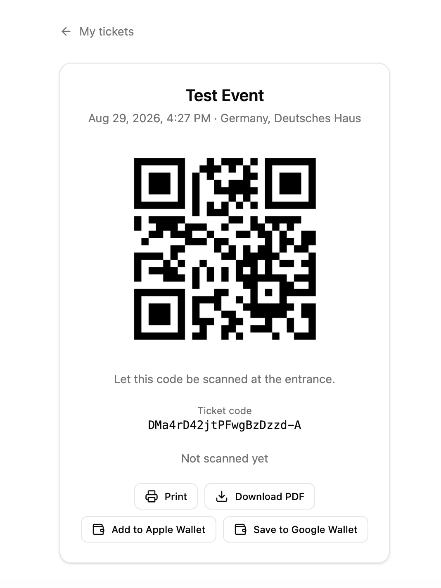

# QueuePass

A ticketing platform. Organisers publish an event, guests buy a ticket without signing up for
anything, and the ticket ends up in Apple Wallet, Google Wallet or as a PDF with a QR code on it.
At the door the organiser scans that QR code in the browser.

Personal project, built to have a full stack of my own to point at.




## What it does

- **Guests** browse events and buy a ticket without setting anything up.
- **Organisers** create and publish events, scan tickets at the entrance, see who arrived, and
  cancel an event with automatic refunds.
- **Admins** get a separate client with all events and orders, revenue, the platform fee and
  payouts.

Both clients are available in German and English.

## The ticket

- **Apple Wallet** as a signed `.pkpass`
- **Google Wallet** through a save link
- **PDF** with the QR code on it, made to be printed
- **In the browser** on the ticket page, which is enough to get scanned at the door

At the entrance the organiser opens the scanner in the browser, points the phone at the QR code and
gets an immediate valid or invalid answer, with an undo for the ticket scanned by mistake.

Wallet passes are optional. Without Apple or Google credentials those two buttons sit greyed out
and the PDF and browser ticket carry on working.

## Tech stack

| Layer    | Choice                                                    |
| -------- | --------------------------------------------------------- |
| API      | Node 22, TypeScript, Express, tRPC, zod, Better Auth      |
| Data     | PostgreSQL, Prisma, S3-compatible storage (MinIO locally) |
| Payments | Stripe Checkout, with a simulated provider as fallback    |
| Tickets  | pdfkit, Apple `.pkpass`, Google Wallet, QR codes          |
| Clients  | Vue 3, Vite, TanStack Query, shadcn-vue, Tailwind         |
| Tests    | Vitest, Playwright (20 specs)                             |

## Running it

Needs Node 22, pnpm 10 and Docker.

```bash
pnpm install
cp apps/api/.env.example apps/api/.env
pnpm db:up                    # Postgres on :5433, MinIO on :9000
pnpm --filter api db:push
pnpm db:seed
pnpm dev
```

User client on `:5173`, admin client on `:5174`, API on `:3000`.

Seeded logins: `organizer@example.com` / `organizer12345` and `admin@example.com` / `admin12345`.

Stripe is optional. Without keys, payments settle through the simulated provider, so a fresh clone
sells tickets right away.

## Tests

```bash
pnpm typecheck
pnpm test       # Vitest, no database needed
pnpm test:e2e   # Playwright, brings up its own stack
```

## Layout

```
apps/api             Express, tRPC, Prisma
apps/user-client     Guests and organisers
apps/admin-client    Backoffice
e2e                  Playwright specs
```
